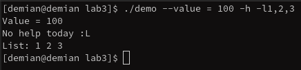
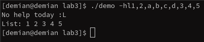

## This program parse command line arguments and return result.

### These keys are supported:
    --help, -h => return help information
    --list, -l => parse arguments into an integer list(string values are ignored)
    --value, -v => parse one integer argument as a value

### Some screenshots
    
    ---
    
    ---
    
    ---
    